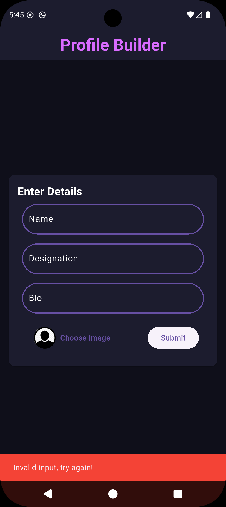

# **Profile Builder - A Flutter Learning Project**

A simple and elegant Flutter application that allows users to create a personal profile card. This project was built by a second-year Computer Science student as a focused challenge to learn the fundamentals of the Flutter framework in under a week.

## **📸 Screenshots & Demo**

A picture is worth a thousand lines of code. Here is a quick demonstration of the app in action.

<table>
  <tr>
    <td align="center">
      
       
      <b>Home Screen</b>
    </td>
    <td align="center">
      
       
      <b>Enter Data Screen</b>
    </td>
    <td align="center">
      
       
      <b>Validation Snack Bar</b>
    </td>
  </tr>
  <tr>
    <td align="center">
      
       
      <b>Form Validation Error</b>
    </td>
    <td align="center">
      
       
      <b>Output Screen</b>
    </td>
    <td align="center">
      
       
      <b>Demo</b>
    </td>
  </tr>
</table>

## **✨ Features**

* **Dynamic Form Inputs:** Clean input fields for essential details like Name, Designation, and Bio.
* **Robust Form Validation:** Ensures that all fields are filled before submission, providing user-friendly feedback.
* **Gallery Image Picker:** Seamlessly select a profile picture from the device's gallery using the image_picker package.
* **Instant Profile Generation:** View the final, beautifully formatted profile card on a separate page.
* **Custom Theming:** A sleek, custom dark-mode theme provides a consistent and visually appealing user experience.
* **Structured Codebase:** The project is organized into logical directories for UI, themes, and reusable widgets, demonstrating professional coding practices.

## **📱 Platform Compatibility**

This project was developed and primarily tested for Android. While Flutter is a cross-platform framework, this specific version has not yet been fully optimized for other platforms. This is a known area for future improvement.

<table>
  <tr>
   <td><strong>Platform</strong>
   </td>
   <td><strong>Status</strong>
   </td>
   <td><strong>Notes</strong>
   </td>
  </tr>
  <tr>
   <td>✅ Android
   </td>
   <td><strong>Supported</strong>
   </td>
   <td>Fully tested and functional.
   </td>
  </tr>
  <tr>
   <td>⚠️ iOS
   </td>
   <td><strong>Known Issues</strong>
   </td>
   <td>May experience some minor layout or dependency issues.
   </td>
  </tr>
  <tr>
   <td>❌ Web/Desktop
   </td>
   <td><strong>Unsupported</strong>
   </td>
   <td>Not currently tested or optimized for web/desktop platforms.
   </td>
  </tr>
</table>

## **🛠️ Technologies & Packages Used**

* **Core:** Flutter, Dart
* **Packages:**
    * image_picker: For selecting images from the device gallery.

## **🌱 My Learning Journey**

As a second-year CS student with a background in the MERN stack, I challenged myself to learn mobile development. This project is the tangible result of that focused effort. Through building the Profile Builder, I gained practical experience with:

* The fundamentals of Flutter's widget-based UI system, including StatefulWidget for managing local state.
* Handling user input and validation effectively using TextFormField and a GlobalKey&lt;FormState>.
* Integrating and utilizing third-party packages from pub.dev.
* Structuring a Flutter application into logical components with separate files.
* Basic navigation between screens using Navigator.push.

## **🚀 Project Evolution**

This project wasn't built in a single day. It represents a rapid learning path over my first week with Flutter:

* **Day 2: The First Step:** My journey began with a simple "Background Color Changer" app. This taught me the absolute basics of Flutter, including StatelessWidget, StatefulWidget, and how to use setState().
* **Day 4: Building the Skeleton:** I then created a hardcoded version of this Profile Builder app. This exercise was crucial for getting comfortable with Flutter's layout widgets like Column, Card, and CircleAvatar without the complexity of user input.
* **Day 6: The Full Application (This Repository):** Finally, I combined all my learnings to create this dynamic version, adding form handling and package integration to create a complete, interactive user experience.

## **📈 Future Improvements**

While this project successfully meets its initial goals, I plan to revisit it to further my learning by:

* **Refactoring State Management:** Implement a more advanced state management solution like Provider or Riverpod to manage state more efficiently.
* **Full Cross-Platform Support:** Refactor UI components and resolve any dependency issues to ensure a seamless experience on iOS.
* **Data Modeling:** Introduce a dedicated Profile data class to manage user data more cleanly and robustly.
* **Save/Share Feature:** Add functionality to save the final profile card as an image to the device gallery or share it with other apps.